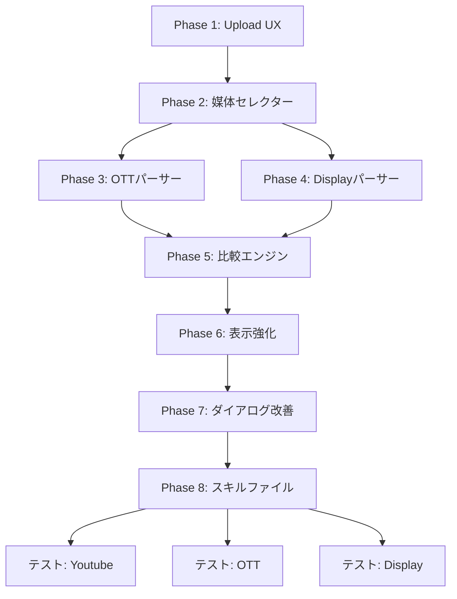

# DV360 設定チェックツール 拡張計画

## 概要

`dv360_check.html`（2129行）を拡張し、Youtube/OTT/Display の3媒体を完全サポートする。
Amazon DSP ツール（`amazon_dsp_check.html`、4395行）のUI/UXを参考に実装する。

## 設計方針

### 変数名ルール
- **DV360固有変数**: `dv*` プレフィックス（例: `dvSettingFiles`, `dvDownloadFiles`）
- **Amazonと衝突防止**: `scFilesS` → `dvSettingFiles`, `scFilesD` → `dvDownloadFiles`
- **既存関数維持**: `parseYoutubeSetting()`, `compareCP()`, `compareIO()` 等は**不変**

### アーキテクチャ

```
┌─────────────────────────────────────────────────────┐
│                   Upload Layer                       │
│  ┌───────────────────┬──────────────────────────┐   │
│  │  📋 設定表ゾーン   │  📥 SDFダウンロードゾーン │   │
│  │  .xlsx/.xlsのみ    │  .zip/.csvのみ            │   │
│  └───────────────────┴──────────────────────────┘   │
└─────────────────────────────────────────────────────┘
                         │
                         ▼
┌─────────────────────────────────────────────────────┐
│              Media Type Detector                     │
│  自動検出: シート名から Youtube/OTT/Display を判別    │
│  手動選択: ドロップダウンで上書き可能                  │
└─────────────────────────────────────────────────────┘
                         │
                         ▼
┌─────────────────────────────────────────────────────┐
│              Parser Router                           │
│  ┌──────────────────────────────────────────┐       │
│  │ mediaType === 'youtube' → parseYoutubeSetting()    │ ✅ 既存維持 │
│  │ mediaType === 'ott'     → parseOttSetting()        │ 🔶 新規    │
│  │ mediaType === 'display' → parseDisplaySetting()    │ 🔶 新規    │
│  └──────────────────────────────────────────┘       │
└─────────────────────────────────────────────────────┘
                         │
                         ▼
┌─────────────────────────────────────────────────────┐
│           Comparison Engine (共通)                    │
│  compareCP() / compareIO() / compareGP() / compareCR() │
│  compareLI() → mediaType で分岐                        │
└─────────────────────────────────────────────────────┘
                         │
                         ▼
┌─────────────────────────────────────────────────────┐
│              Render Layer                            │
│  結果ヘッダーバー / 凡例 / レベルタブ / フィルタ      │
│  行高調整 / 列切替 / IOグループ化                    │
└─────────────────────────────────────────────────────┘
```

## Phase別実装詳細

### Phase 0: 準備（完了済み）
- [x] Amazon ツールの関数確認
- [x] PLAN.md 読解
- [x] 既存 dv360_check.html の構造把握

### Phase 1: Upload UX → 2ゾーン方式

#### 変更箇所
**ファイル**: `dv360_check.html` 行252-276

**現在の構造**（削除対象）:
```html
<div class="upload-section">
  <div id="upload-zone" class="multi-upload-zone">...</div>
</div>
```

**新しい構造**:
```html
<!-- メディアセレクター -->
<div id="dv-media-bar" style="background:#f0f4f8;border:1px solid #dce3ea;padding:10px 20px;display:flex;align-items:center;gap:12px;">
  <label for="dv-media-select" style="font-weight:bold;font-size:0.85rem;color:#2c3e50;">🎯 チェック対象：</label>
  <select id="dv-media-select" style="padding:5px 10px;border:1px solid #3498db;border-radius:4px;font-size:0.85rem;">
    <option value="auto">⚡ 自動検出（推奨）</option>
    <option value="youtube">Youtube（TrueView）</option>
    <option value="ott">OTT（Netflix等）</option>
    <option value="display">Display</option>
  </select>
  <span id="dv-media-badge" style="display:none;background:#3498db;color:white;border-radius:10px;padding:2px 10px;font-size:0.78rem;font-weight:bold;"></span>
  <span id="dv-control-info" style="font-size:0.78rem;color:#888;margin-left:auto;"></span>
</div>

<!-- 2ゾーンアップロード -->
<div style="display:grid; grid-template-columns:1fr 1fr; gap:16px; padding:16px 20px;">
  <!-- 設定表ゾーン -->
  <div>
    <div style="font-weight:bold;font-size:0.9rem;color:#2c3e50;margin-bottom:8px;">📋 設定表（.xlsx）</div>
    <div id="dv-drop-setting" class="dv-drop-zone" style="border:2px dashed #3498db;border-radius:10px;padding:20px;text-align:center;cursor:pointer;background:#f8fbfe;min-height:100px;">
      <div class="dv-upload-icon">📊</div>
      <div class="dv-upload-text">設定表をドラッグ＆ドロップ</div>
      <div class="dv-upload-sub">またはクリックして選択（.xlsx 複数可）</div>
      <input type="file" id="dv-input-setting" accept=".xlsx,.xls" multiple style="display:none">
    </div>
    <div id="dv-setting-list" style="margin-top:8px;"></div>
  </div>
  <!-- SDFダウンロードゾーン -->
  <div>
    <div style="font-weight:bold;font-size:0.9rem;color:#2c3e50;margin-bottom:8px;">📥 SDFダウンロード（.zip/.csv）</div>
    <div id="dv-drop-download" class="dv-drop-zone" style="border:2px dashed #27ae60;border-radius:10px;padding:20px;text-align:center;cursor:pointer;background:#f0fff4;min-height:100px;">
      <div class="dv-upload-icon">📦</div>
      <div class="dv-upload-text">SDFデータをドラッグ＆ドロップ</div>
      <div class="dv-upload-sub">またはクリックして選択（.zip / .csv 複数可）</div>
      <input type="file" id="dv-input-download" accept=".zip,.csv" multiple style="display:none">
    </div>
    <div id="dv-download-list" style="margin-top:8px;"></div>
  </div>
</div>

<!-- コントロール -->
<div id="dv-controls" style="display:none;align-items:center;gap:10px;padding:8px 20px;flex-wrap:wrap;">
  <button class="btn btn-check" onclick="dvRunCheck()">🔍 チェック開始</button>
  <button class="btn btn-reset" onclick="dvResetAll()">🗑️ リセット</button>
  <button class="btn btn-sm" onclick="showStatusDialog()" style="background:#8e44ad;color:white;">📋 案件タイプ設定</button>
</div>
```

#### JavaScript関数

| 新関数名 | 機能 | Amazon由来 |
|---------|------|-----------|
| `dvInitUpload(side)` | ドロップゾーン初期化 | `initScMultiDrop()` |
| `dvHandleFiles(side, files)` | ファイル処理・分類 | `handleScFiles()` |
| `dvRenderFileList(side)` | ファイルリスト表示 | `renderScFileList()` |
| `dvRemoveFile(side, idx)` | ファイル削除 | `scRemoveFile()` |
| `dvUpdateControls()` | コントロール表示切替 | - |

#### 状態変数

```javascript
let dvSettingFiles = [];   // 設定表ファイル (.xlsx)
let dvDownloadFiles = [];  // SDFダウンロードファイル (.zip, .csv)
let dvMediaDetected = 'auto'; // 自動検出媒体
```

### Phase 2: 媒体タイプセレクター

#### 既存関数拡張
```javascript
// 既存の detectMediaType() を維持し、媒体名を返すように変更
function detectMediaTypeFromSheets(sheetNames){
  const all = sheetNames.join(' ');
  if(all.includes('TrueView')||all.includes('Youtube')||all.includes('VRC')||
     all.includes('VVC')||all.includes('運用者')||all.includes('業推')) return 'youtube';
  if(all.includes('OTT')||all.includes('Netflix')||all.includes('新FMT')) return 'ott';
  if(all.includes('Display')||all.includes('DV360')||all.includes('設定シート')) return 'display';
  return 'youtube'; // デフォルト
}
```

#### 媒体セレクター連携
```javascript
// 設定表ファイル読み込み後に媒体を自動検出
function dvAutoDetectMedia(){
  // 設定表のシート名から検出
  // セレクターが「自動」なら検出結果を設定
  // バッジ表示を更新
}
```

### Phase 3: OTT 設定表パーサー

#### 関数名: `parseOttSetting(sheets, sheetNames, fileName)`

**ベース**: Amazonの [`readSettingTableVideo()`](amazon_dsp_check.html:1350)

**特徴**:
- 「新FMT_設定シート」形式に対応
- 1シート完結型
- ヘッダーに「ラインアイテム名」/「Line Item Name」を検出
- OTT固有フィールド: SSP, DealID, コンテンツ, Netflix配信先

**COL_KEYWORDS**:
```javascript
const OTT_COL_KEYWORDS = {
  liName:   ['ラインアイテム名','Line Item Name'],
  media:    ['メディア','Type','Media'],
  device:   ['Device type'],
  startDay: ['Start day','開始日'],
  startTime:['Start time','開始時間'],
  endDay:   ['End day','終了日'],
  endTime:  ['End time','終了時間'],
  budget:   ['予算','Line item budget','Budget'],
  pacing:   ['配信ペース','Pacing','Pacing profile'],
  ssp:      ['SSP','Supply sources','Supply source'],
  dealId:   ['DealID','Deal ID','Deal selection'],
  dealName: ['Deal名','Deal Name'],
  content:  ['コンテンツ','Content','Targeting - Content'],
  location: ['配信地域','Location','Location targeting'],
  language: ['Language','言語'],
  inventory:['広告枠ソース','Inventory'],
  videoFormat:['動画フォーマット','Video ad format'],
  frequency:['Frequency','フリークエンシー'],
};
```

### Phase 4: Display 設定表パーサー

#### 関数名: `parseDisplaySetting(sheets, sheetNames, fileName)`

**ベース**: `parseOttSetting()` を共用し、Display固有フィールドを追加

**Display固有フィールド**:
```javascript
baseCpm:   ['ベースCPM','Base supply bid'],
maxCpm:    ['上限CPM','Maximum average CPM','Max supply bid'],
autoOpt:   ['自動最適化','Automated optimization'],
fee3p:     ['3P Fee','3Pフィー'],
frequency: ['Frequency','フリークエンシー','Frequency Caps'],
productSmall: ['商材カテゴリ','Product categories'],
```

### Phase 5: 比較エンジン媒体別分岐

#### 既存コード変更箇所
**ファイル**: `dv360_check.html` 行1174-1186

**変更前**:
```javascript
if(mediaType==='youtube'){
  const p=parseYoutubeSetting(sf.sheets,sf.sheetNames,sf.fileName);
  // ...
}
```

**変更後**:
```javascript
const mediaParsers = {
  youtube: parseYoutubeSetting,  // 既存維持
  ott: parseOttSetting,          // 新規
  display: parseDisplaySetting,  // 新規
};
const parser = mediaParsers[mediaType] || parseYoutubeSetting;
const p = parser(sf.sheets, sf.sheetNames, sf.fileName);
```

#### LI比較フィールドの媒体別定義

```javascript
// ファイル先頭に追加
const DV_YOUTUBE_LI_COLUMNS = [
  {key:'動画タイプ', label:'動画タイプ'},
  {key:'開始日', label:'開始日'},
  {key:'終了日', label:'終了日'},
  {key:'予算(グロス)', label:'予算(グロス)'},
  {key:'配信ペース', label:'配信ペース'},
  {key:'課金形態', label:'課金形態'},
  {key:'入札単価', label:'入札単価'},
  {key:'フリークエンシー', label:'フリークエンシー'},
  {key:'広告枠ソース', label:'広告枠ソース'},
];

const DV_OTT_LI_COLUMNS = [
  {key:'メディア', label:'メディア'},
  {key:'Device type', label:'Device'},
  {key:'開始日', label:'開始日'},
  {key:'終了日', label:'終了日'},
  {key:'予算', label:'予算'},
  {key:'配信ペース', label:'配信ペース'},
  {key:'SSP', label:'SSP'},
  {key:'DealID', label:'DealID'},
  {key:'コンテンツ', label:'コンテンツ'},
  {key:'配信地域', label:'配信地域'},
  {key:'言語', label:'言語'},
];

const DV_DISPLAY_LI_COLUMNS = [
  {key:'メディア', label:'メディア'},
  {key:'Device type', label:'Device'},
  {key:'開始日', label:'開始日'},
  {key:'終了日', label:'終了日'},
  {key:'予算', label:'予算'},
  {key:'配信ペース', label:'配信ペース'},
  {key:'ベースCPM', label:'ベースCPM'},
  {key:'上限CPM', label:'上限CPM'},
  {key:'自動最適化', label:'自動最適化'},
  {key:'3P Fee', label:'3P Fee'},
  {key:'Frequency', label:'Frequency'},
  {key:'SSP', label:'SSP'},
  {key:'商材カテゴリ', label:'商材カテゴリ'},
  {key:'配信地域', label:'配信地域'},
  {key:'言語', label:'言語'},
];
```

#### compareLI() 拡張
```javascript
function compareLI(s, d, media){
  if(media === 'youtube') return compareLI_Youtube(s, d);  // 既存維持
  if(media === 'ott')     return compareLI_Ott(s, d);      // 新規
  if(media === 'display') return compareLI_Display(s, d);  // 新規
  return [];
}
```

### Phase 6: 表示の強化

#### 6-1: 結果ヘッダーバー
- チェック結果サマリー（設定表件数 / SDFファイル数 / マッチ数 / 不一致数）
- 案件タイプ設定ボタン

#### 6-2: 行高調整スライダー
```javascript
let DV_ROW_HEIGHT = 50;

function dvUpdateRowHeight(val){
  DV_ROW_HEIGHT = parseInt(val);
  document.querySelectorAll('#dv-result-table-wrap td').forEach(td => {
    td.style.height = DV_ROW_HEIGHT + 'px';
  });
  try { sessionStorage.setItem('dv_row_height', DV_ROW_HEIGHT); } catch(e){}
}
```

#### 6-3: IOグループ化（LIレベルのみ）
- Amazonの `renderScResult()` 風
- IO名でLIをグループ化し、グループヘッダーに行を表示

### Phase 7: ステータスダイアログ改善

- デフォルトは「初期案件」で即チェック開始
- 「📋 案件タイプ設定」ボタンでいつでも設定変更可能

### Phase 8: スキルファイル作成

#### .claude/skills/dv360-dev-guide.md
- 新規媒体追加手順
- パーサーテンプレート
- カラム定義方法

#### .claude/skills/dv360-test-runner.md
- テストデータ場所
- テスト手順
- 検証項目

## 実装順序と依存関係



## 注意事項

1. **既存Youtubeパーサー不変**: `parseYoutubeSetting()` の中身は一切変更しない
2. **変数プリフィックス**: `dv*` を統一（Amazonの `sc*` と衝突防止）
3. **段階的テスト**: 各Phase完了後にブラウザで動作確認
4. **セッションストレージ**: 行高・列幅の設定は `sessionStorage` に保存

## 見積行数

| Phase | 追加行数 | 変更行数 |
|-------|---------|---------|
| Phase 1 | ~150 | ~50（既存uploadZone削除） |
| Phase 2 | ~80 | ~20 |
| Phase 3 | ~200 | 0 |
| Phase 4 | ~100 | 0 |
| Phase 5 | ~150 | ~50 |
| Phase 6 | ~250 | ~30 |
| Phase 7 | ~50 | ~30 |
| Phase 8 | ~100 | 0 |
| **合計** | **~1080** | **~180** |

最終的に: 2129 → 約3300行
